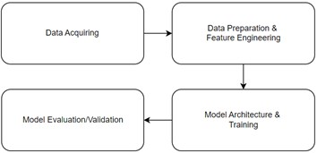

# MotorActivityAnlaysis_DepressionPrediction

<h2>Requirement</h2>
Python 3.11.2 for kernel  
Basic Model:
<ul>
  <li>pandas</li>
  <li>matplotlib</li>
  <li>tensorflow</li>
  <li>scikit-learn</li>
</ul>
Model with SMOTE and Final Model
<ul>
  <li>[same with Basic Model]</li>
  <li>imblearn</li>
</ul>

<h2>Introduction</h2>

Many things we do in our daily lives can increase the risk of developing depression, from having extreme different sleep time between weekday and weekends, or even doing to much activity in a day, due to it being so easy to increase the risk on developing depression makes depression one of the most common mental illnesses. if depression is allowed to get worse, there will be many negative impacts that arise either from thoughts or actions. Worst case scenario it can drive people to commit suicide.

<h2>Aim</h2>

The aim of this model is to predict depression at the earliest stage, in hope that the person diagnosed could get treated as early as possible too. Thus the reason of creating the hybrid model using CNN and LSTM.

<h2>Method</h2>

The methodology can be seen from the image, start from aquiring the dataset from <a href="https://datasets.simula.no/depresjon/">here.</a> After that the next step is preprocessing, in this step the data would be load and turned into dataframe, then the value would be normalized on the final model augmentation would be applied to add variant, and then oversampling would be applied, except on the BasicModel. Next is model training, the model has to be created firstly, it require conv1d layer to extract features automatically and then LSTM for learning the extracted feature pattern. Maxpooling and dropout is also applied for enhance processing and prevent overfitting, then flatten and dense layer is responsible for classifying the data. The model would undergoes 20 epochs of training, and validated using k-fold.

<h2>Result</h2>
<table>
  <tr>
    <th>Models</th>
    <th>Accuracy</th>
    <th>Precision</th>
    <th>Recall</th>
    <th>F1</th>
  </tr>
  <tr>
    <td>Basic Model</td>
    <td>0.7277</td>
    <td>0.7500</td>
    <td>0.6000</td>
    <td>0.6667</td>
  </tr>
  
  <tr>
    <td>Model with SMOTE</td>
    <td>0.8462</td>
    <td>0.8571</td>
    <td>0.8571</td>
    <td>0.8571</td>
  </tr>
  
  <tr>
    <td>FinalModel</td>
    <td>0.9789</td>
    <td>0.8571</td>
    <td>1.0000</td>
    <td>0.9231</td>
  </tr>
</table>

Three models were created, and six in total if modification is counted. The first model is Basic Model it achieved 72% accuracy, and improved to 84% after balancing the data using SMOTE. it improved further to 97% in the final model after k-fold is applied along with others validation and preprocessing methods.

<h2>Suggestion for future works</h2>
<ul>
  <li>Try using other kind of classifier or methods for oversampling and validation.</li>
  <li>Try classify depression even further to unipolar or bipolar class.</li>
</ul>
